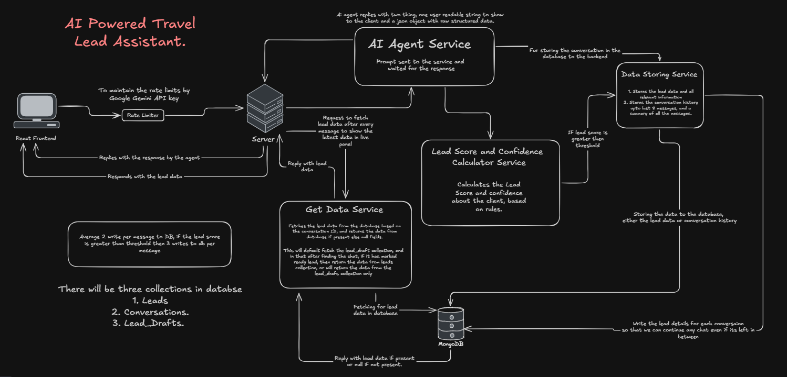

# AI Travel Assistant — Project Documentation & Architecture

This is the overarching architecture and documentation for the AI Travel Assistant, designed to interface with the Google Gemini API. This document details the architectural decisions and system design before implementation begins.

---

## Table of Contents

1. [Project Overview](#project-overview)
2. [Recent Architecture Updates](#recent-architecture-updates)
3. [High Level Design](#high-level-design-hld)
4. [Tech Stack](#tech-stack)
5. [File & Folder Structure](#file--folder-structure)
6. [Database Design](#database-design)
7. [API Contracts](#api-contracts)
8. [Core Services](#core-services)
9. [Score Calculator Logic](#score-calculator-logic)
10. [System Prompt Design](#system-prompt-design)
11. [Frontend State Management](#frontend-state-management)
12. [Rate Limiting](#rate-limiting)
13. [Environment Configuration](#environment-configuration)
14. [DB Write Pattern](#db-write-pattern-per-message-turn)
15. [Conversation Resume Design](#conversation-resume-design)
16. [Edge Cases & Assumptions](#edge-cases--assumptions)
17. [Sample Conversations & Lead JSON](#sample-conversations--lead-json)
18. [Known Limitations](#known-limitations)

---

## Project Overview

This application is an AI-powered travel assistant that:

- Converses naturally with users to understand their travel requirements
- Continuously extracts structured travel data from natural language
- Scores each conversation in real time using deterministic, rule-based logic
- Detects genuine buying intent and captures qualified leads
- Stores qualified leads with full contact and travel details for follow-up by a travel consultant


---

## Recent Architecture Updates

Prior to implementation, the following updates were made to the High-Level Design (HLD) and explicitly reflected in this LLD to ensure consistency:

- **Three MongoDB Collections**: Split storage into `leads` (qualified only), `conversations` (history + summary), and `lead_drafts` (partial state per conversation, updated every turn). This enables chat resumption even if a user leaves mid-conversation.
- **API Contracts**: Modified the Chat Endpoint to return RAW structured data for extracted fields instead of heavily pre-processed statuses. The server computes score and flags — the frontend just renders.
- **Lead Retrieval**: Updated the Specific Lead Endpoint logic to check `lead_drafts` first, then return from `leads` if the conversation ever reached the qualification threshold.

---

## High Level Design (HLD)



The HLD shows the full request lifecycle:

```
React Frontend (Chat Panel + Live Lead Panel)
        │
        ▼
   Rate Limiter (10 RPM per IP)
        │
        ▼
   Express Server
        ├──► AI Agent Service (Gemini 3.1 Flash Lite)
        │         └── returns: reply + raw extractedFields
        │
        ├──► Score Calculator Service (pure JS, rule-based)
        │         └── returns: score, confidence, readyToCapture, leadReady
        │
        ├──► Data Storing Service
        │         ├── always: upsert conversations + lead_drafts   [2 writes]
        │         └── if leadReady: upsert leads                   [+1 write]
        │
        └──► Get Data Service
                  └── reads lead_drafts → if leadReady, reads leads
                  └── returns current lead state to frontend
```

---

## Tech Stack

| Layer | Choice | Reason |
|---|---|---|
| Frontend | React + Vite + Tailwind CSS | Fast scaffold, component-first, familiar stack |
| Backend | Node.js + Express | Lightweight, JSON-native, easy middleware |
| Database | MongoDB Atlas (Free Tier) | Document-native, fits lead structure, free |
| AI Model | Gemini 3.1 Flash Lite | Best free-tier quality (Intelligence Index 34 vs 16 for 2.5), 500 RPD, 15 RPM |


**Why rule-based scoring over AI scoring:**
Letting the AI score itself introduces non-determinism — the same conversation could score differently across runs. A pure JS additive scoring function is predictable, testable, and fully explainable in this document.

---

## File & Folder Structure

```text
travel-lead-ai/
├── frontend/                          # Vite + React Frontend
│   ├── src/
│   │   ├── components/
│   │   │   ├── ChatPanel.jsx        # Message list + input box
│   │   │   ├── MessageBubble.jsx    # Single message bubble (user / assistant)
│   │   │   ├── LeadPanel.jsx        # Live sidebar showing all captured fields
│   │   │   ├── FieldRow.jsx         # One field row — label + value or null placeholder
│   │   │   └── ScoreBadge.jsx       # Score arc + confidence pill (Low / Medium / High)
│   │   ├── hooks/
│   │   │   └── useChat.js           # All state + API call logic
│   │   ├── utils/
│   │   │   └── conversationId.js    # Generates conv ID once, persists in sessionStorage
│   │   ├── App.jsx
│   │   ├── main.jsx
│   │   └── index.css
│   ├── .env                         # VITE_API_URL
│   └── vite.config.js
│
├── backend/                          # Node.js + Express Backend
│   ├── routes/
│   │   ├── chat.js                  # POST /api/chat
│   │   └── leads.js                 # GET /api/leads, GET /api/leads/:convId
│   ├── services/
│   │   ├── geminiService.js         # AI Agent — calls Gemini, parses reply + JSON block
│   │   ├── scoreService.js          # Lead Score + Confidence Calculator (pure JS)
│   │   └── dataService.js           # All MongoDB operations (3 collections)
│   ├── models/
│   │   ├── Lead.js                  # Mongoose schema — qualified leads only
│   │   ├── LeadDraft.js             # Mongoose schema — partial state, every conversation
│   │   └── Conversation.js          # Mongoose schema — history + summary
│   ├── prompts/
│   │   └── systemPrompt.js          # Exported system prompt string
│   ├── middleware/
│   │   └── rateLimiter.js           # express-rate-limit config
│   ├── db.js                        # Mongoose connect
│   ├── index.js                     # App entry, mounts routes + middleware
│   └── .env                         # Backend environment variables
│
└── README.md
```

---

## Database Design

### Three Collections

| Collection | Purpose | Write Frequency |
|---|---|---|
| `lead_drafts` | Partial lead state for every active conversation. Updated every turn so the chat can be resumed if the user leaves. | Every message turn |
| `conversations` | Last 8 messages + AI-generated summary. Enables context to be passed back to Gemini without hitting TPM limits. | Every message turn |
| `leads` | Fully qualified leads only — score ≥ 65, name and phone present. Used by travel consultants for follow-up. | Only when `leadReady === true` |

### Lead Schema (qualified leads — `leads` collection)

| Field | Type | Notes |
|---|---|---|
| `conversationId` | String (PK, unique) | Shared key across all 3 collections |
| `customer.name` | String | null until captured |
| `customer.phone` | String | null until captured |
| `customer.email` | String | optional per spec |
| `travel.destination` | String | null until mentioned |

| `travel.travelDate` | String | stored as user said it — "December", "next March" |
| `travel.travellers` | Number | stored as integer, not string |
| `travel.budget` | String | stored as user said it — "Rs 2 lakh", "around 50k" |
| `travel.duration` | String | null until mentioned |
| `travel.tripType` | String | "Honeymoon", "Family", "Solo", etc. |
| `travel.specialRequirements` | String | null until mentioned |
| `qualification.leadScore` | Number | 0–100 |
| `qualification.confidence` | String (enum) | Low / Medium / High |
| `qualification.reason` | String | human-readable explanation of score |
| `qualification.summary` | String | one-paragraph summary of user requirements |
| `createdAt` | Date | set on first upsert |
| `updatedAt` | Date | updated on every upsert |

**Why `travelDate` and `budget` are strings:** Parsing "Rs 2 lakh" into a number or "sometime next March" into a date would be lossy and error-prone. Stored verbatim, no information is lost, and the travel consultant sees exactly what the user said.

### LeadDraft Schema (`lead_drafts` collection)

Same field structure as Lead, but written on every turn regardless of score. Acts as the live working copy of the lead state. The frontend reads from this to power the live panel.

### Conversation Schema (`conversations` collection)

| Field | Type | Notes |
|---|---|---|
| `conversationId` | String (PK, unique) | |
| `history` | Array of `{role, content}` | Max 8 messages (sliding window) |
| `summary` | String | Generated by Gemini when history overflows 8 messages |
| `updatedAt` | Date | |

**Why cap at 8 messages:** Gemini 3.1 Flash Lite free tier allows 250,000 TPM. With a ~900 token system prompt, each turn consuming ~200–400 tokens of history, 8 messages keeps us well within TPM limits while maintaining enough context for coherent conversation.

---

## API Contracts

### `POST /api/chat`

**Request**
```json
{
  "conversationId": "conv_abc123",
  "messages": [
    { "role": "user",  "content": "I want to plan a trip to Bali" },
    { "role": "model", "content": "How exciting! When are you thinking of going?" }
  ],
  "summary" : "The conversation just started",
  "userMessage": "This December, for our honeymoon"
}
```

- `messages` — full history held on the frontend (backend is stateless per request)
- `userMessage` — the new message; server appends it before calling Gemini
- Server trims `messages` to last 8 before sending to Gemini

**Response**
```json
{
  "reply": "Congratulations on your upcoming honeymoon! Bali is a fantastic choice. How many of you will be travelling?",
  "extractedFields": {
    "destination": "Bali",

    "travelDate": "December",
    "travellers": null,
    "budget": null,
    "duration": null,
    "tripType": "Honeymoon",
    "specialRequirements": null,
    "name": null,
    "phone": null,
    "email": null
  },
  "qualification": {
    "leadScore": 45,
    "confidence": "Low",
    "reason": "Destination, travel date and trip type captured. Traveller count, budget and contact details missing.",
    "summary": "User planning a Bali honeymoon in December.",
    "readyToCapture": false,
    "leadReady": false
  },
  "leadSaved": false,
  "leadId": null
}
```

---

### `GET /api/leads`

Returns all qualified leads. Used for verification.

**Response**
```json
{
  "leads": [ ...Lead documents ]
}
```

---

### `GET /api/leads/:conversationId`

Returns the lead for a specific conversation. Checks `lead_drafts` first — if `leadReady` is true, returns the richer record from `leads`.

**Response**
```json
{ "lead": { ...Lead document } }
```
or
```json
{ "lead": null }
```

---

## Core Services

### `geminiService.js` — AI Agent Service

**Responsibilities:**
- Prepends the system prompt to the conversation history
- Trims message history to last 8 before sending (TPM management)
- Calls Gemini 3.1 Flash Lite API
- Splits raw response on `|||JSON_START|||` / `|||JSON_END|||` delimiters
- Returns `{ reply: string, extractedFields: object }`

**Error handling:** If JSON parsing fails (model occasionally skips the block), the service returns the reply with all `extractedFields` as `null` and logs the raw response. The conversation continues — next turn re-extracts from updated history.

**Function signature:**
```js
async function callGemini(messages, userMessage)
// returns: { reply, extractedFields }
```

---

### `scoreService.js` — Score & Confidence Calculator

**Responsibilities:**
- Pure JS function, zero external dependencies
- Applies additive scoring rules (see Score Calculator section)
- Returns score, confidence, reason string, summary string, and qualification flags

**Why not AI-based scoring:** Deterministic rule-based scoring is predictable, testable with unit tests, and fully explainable. The same inputs always produce the same score.

**Function signature:**
```js
function calculateScore(extractedFields)
// returns: { leadScore, confidence, reason, summary, readyToCapture, leadReady }
```

---

### `dataService.js` — Data Storing + Get Data Service

**Responsibilities:**
- `upsertLeadDraft` — always called, updates partial lead state every turn
- `upsertConversation` — always called, trims history to 8, saves/updates
- `upsertLead` — called only when `leadReady === true`
- `getLeadData` — checks `lead_drafts` by conversationId; if `leadReady`, also fetches from `leads` and returns richer record

All writes use MongoDB `findOneAndUpdate` with `upsert: true` on `conversationId` — fully idempotent, no duplicate records on double submit.

**Function signatures:**
```js
async function upsertLeadDraft(conversationId, extractedFields, qualification)
async function upsertConversation(conversationId, messages)
async function upsertLead(conversationId, extractedFields, qualification)
async function getLeadData(conversationId)
```

---

## Score Calculator Logic

Scoring is additive. Each field contributes a fixed number of points when present.

| Signal | Points | Notes |
|---|---|---|
| Destination specified | +20 | Highest weight — the core of any travel enquiry |
| Travel date — specific (month/year) | +15 | e.g. "December", "March 2026" |
| Travel date — vague ("next year", "sometime") | +8 | Partial credit — intent present but planning is loose |
| Traveller count | +10 | |
| Budget specified | +15 | Strong buying signal |
| Trip type (honeymoon, family, solo, etc.) | +10 | Indicates purpose and package type |
| Departure city | +5 | Secondary detail |
| Special requirements | +5 | Secondary detail |
| Name captured | +10 | Contact qualification begins |
| Phone captured | +10 | Contact qualification complete |
| **Maximum** | **100** | |

**How vague dates are detected:** Simple regex on the `travelDate` string — `/next year|sometime|later|not sure|flexible/i`. If matched, partial credit (+8). Otherwise full credit (+15) for any non-null date string.

### Confidence Mapping

| Score Range | Confidence | Meaning |
|---|---|---|
| 0 – 49 | Low | Early exploration, insufficient detail |
| 50 – 64 | Medium | Clear intent, missing key details or contact |
| 65 – 100 | High | Well-qualified lead with contact details |

### Qualification Flags

| Flag | Condition | Action |
|---|---|---|
| `readyToCapture` | Score ≥ 50 AND name is null | AI should now politely ask for name and phone |
| `leadReady` | Score ≥ 65 AND name present AND phone present | Trigger `upsertLead` to `leads` collection |

### Score Examples

| Scenario | Score Breakdown | Total | Confidence |
|---|---|---|---|
| "Tell me about Bali" | destination +20 | 20 | Low |
| "Planning a trip to Europe in December" | destination +20, date +15 | 35 | Low |
| "Honeymoon in Bali, December, 2 people" | destination +20, date +15, travellers +10, tripType +10 | 55 | Medium |
| Above + budget Rs 2 lakh | +15 | 70 | High |
| Above + name and phone | +20 | 90 | High → leadReady |

---

## System Prompt Design

The system prompt is the core intelligence of the assistant. It performs three jobs in a single call:

**Job 1 — Conversational guidance:** How to ask questions, what order to prioritise, when to request contact details, how to handle edge cases.

**Job 2 — Field extraction:** What to extract and in what format from natural language.

**Job 3 — Structured output enforcement:** Appending a JSON block after every reply using delimiters the backend can reliably parse.

```
You are a warm, helpful travel assistant for an Indian travel company.
Your job is to understand what the user wants and help plan their trip,
while naturally gathering key travel details over the conversation.

CONVERSATION RULES:
- Be natural. Never ask multiple questions at once.
- Ask ONE follow-up question per response, targeting the most important missing field.
- Do NOT ask for name or phone until: destination + at least one of (date, budget, travellers) is known.
- If the user volunteers contact info early, accept it gracefully and continue.
- If the user says "just browsing" or "only exploring", be helpful but do not push for contact.
- If the user declines contact details, respect it completely and keep helping.
- Vague answers like "sometime next year" are valid — accept and store them.
- Once you have destination + date + travellers + budget, ask for contact naturally:
  "To connect you with one of our travel consultants for a personalised package,
   may I have your name and a contact number?"

FIELD PRIORITY (gather roughly in this order):
1. Destination
2. Travel date / month
3. Number of travellers
4. Budget
5. Trip type (honeymoon, family, solo, business)
6. Departure city
7. Duration
8. Special requirements
9. Name → Phone
10. Email

After EVERY response, append a JSON block between these exact delimiters.
This is parsed by the server — never mention it to the user.

|||JSON_START|||
{
  "extractedFields": {
    "destination": null,

    "travelDate": null,
    "travellers": null,
    "budget": null,
    "duration": null,
    "tripType": null,
    "specialRequirements": null,
    "name": null,
    "phone": null,
    "email": null
  }
}
|||JSON_END|||

JSON RULES:
- Always include all 11 fields. Use null for anything not yet known.
- Carry forward all previously captured values — never drop a field once filled.
- travellers must be a number (2), not a string ("two").
- budget: store exactly as user said ("Rs 2 lakh", "around 50k").
- travelDate: store exactly as user said ("December", "next March", "sometime next year").
- Never fabricate or infer values. Only populate what the user explicitly stated.
```

**Why delimiter-based parsing over JSON-mode:** Gemini's JSON mode sometimes strips the conversational reply. The delimiter approach keeps the human reply and structured data in one response, split cleanly on the backend with `response.split('|||JSON_START|||')`.

---

## Frontend State Management

All state lives in `useChat.js` and is passed down as props. While the frontend manages the local state for rapid UI updates, the message history is permanently stored in the backend database. On initial load, the frontend fetches the existing message history and lead draft state using the `conversationId` to ensure the chat fully persists across reloads.

```js
// Message history — initialized from backend on load, updated locally
const [messages, setMessages] = useState([]);
// { id, role: 'user'|'assistant', content, timestamp }

// Live extracted fields — updates after every server response
const [extractedFields, setExtractedFields] = useState({
  destination: null, travelDate: null,
  travellers: null, budget: null, duration: null,
  tripType: null, specialRequirements: null,
  name: null, phone: null, email: null,
});

// Lead qualification state
const [qualification, setQualification] = useState({
  leadScore: 0, confidence: 'Low',
  reason: '', summary: '',
  readyToCapture: false, leadReady: false,
});

// UI state
const [leadSaved, setLeadSaved] = useState(false);
const [isLoading, setIsLoading] = useState(false);

// Stable conversation ID — generated once, persists across reloads
const [conversationId] = useState(() => {
  const existing = sessionStorage.getItem('convId');
  if (existing) return existing;
  const id = 'conv_' + Math.random().toString(36).slice(2, 10);
  sessionStorage.setItem('convId', id);
  return id;
});
```

### Component Props

```
App
├── ChatPanel       { messages, isLoading, onSend }
│   ├── MessageBubble (×n)  { role, content, timestamp }
│   └── InputBox    { onSend, isLoading }
│
└── LeadPanel       { extractedFields, qualification, leadSaved }
    ├── ScoreBadge  { score, confidence }
    └── FieldRow (×11)  { label, value }  ← null renders as grey placeholder
```

---


## Rate Limiting

```
Window:       60 seconds
Max requests: 10 per IP per window
Response:     429 with human-readable error message
```

Gemini 3.1 Flash Lite allows 15 RPM on the free tier. The server limit is set to 10 RPM to leave headroom for burst scenarios (multiple tabs, rapid testing) without risking a 429 from Gemini upstream.

---

## Environment Configuration

```bash
# backend/.env
PORT=5000
MONGODB_URI=mongodb+srv://<user>:<pass>@cluster.mongodb.net/travel-leads
GEMINI_API_KEY=AIza...
LEAD_SCORE_THRESHOLD=65
RATE_LIMIT_WINDOW_MS=60000
RATE_LIMIT_MAX=10
CLIENT_URL=http://localhost:5173

# frontend/.env
VITE_API_URL=http://localhost:5000
```

---

## DB Write Pattern Per Message Turn

| Condition | Writes | Collections touched |
|---|---|---|
| Normal turn (score < 65 or no contact) | 2 writes | `conversations` + `lead_drafts` |
| Qualifying turn (score ≥ 65, name + phone present) | 3 writes | `conversations` + `lead_drafts` + `leads` |

All writes use `findOneAndUpdate` with `upsert: true` — idempotent on `conversationId`. A double-submitted message results in the same document being overwritten, not duplicated.

---

## Conversation Resume Design

This is a feature beyond the spec requirements. When a user returns to the app mid-conversation:

1. `sessionStorage` preserves the `conversationId` across page reloads
2. On load, the frontend calls `GET /api/leads/:conversationId`
3. The server reads the lead state from `lead_drafts` and the message history from `conversations`.
4. The frontend restores `messages`, `extractedFields`, and `qualification` from this response.
5. The user can continue from where they left off seamlessly — the chat UI is fully restored from the database and no context is lost.

This means no partial lead data is ever lost even if the user closes the tab.

---

## Edge Cases & Assumptions

| Scenario | System Behaviour | Design Decision |
|---|---|---|
| User shares contact info very early | Accepted gracefully. Name/phone stored in `extractedFields`. Score stays low until travel details accumulate. `leadReady` stays false until score ≥ 65. |  |
| User refuses contact details | Conversation continues helpfully. Score capped at ~75 (no name/phone points). Lead never saved to `leads`. `lead_drafts` still updated. |  |
| Interest drops mid-conversation | AI does not push. `readyToCapture` and `leadReady` remain false. No lead saved. |  |
| Vague travel date ("sometime next year") | Accepted and stored as-is. +8 points instead of +15. Detected via regex on the date string. ||
| AI fails to append JSON block | Backend catches parse error. Reply returned to user. All fields set to null. Re-extraction attempted next turn from full history. |  |
| Double submission (same message sent twice) | All DB writes use upsert on `conversationId`. Document overwritten, not duplicated. | |
| Partial contact (name but no phone) | `leadReady` remains false. Name stored and displayed in live panel. AI naturally follows up for phone. | |
| User asks off-topic questions | Assistant answers briefly and steers back to travel planning naturally. |  |
| Very long conversation (>8 messages) | History trimmed to last 8 before sending to Gemini. A summary of earlier turns is generated and prepended as context. |  |

---

## Sample Conversations & Lead JSON

### Sample 1 — High Intent, Full Qualification

**Conversation:**
```
User: I'm planning a honeymoon in Bali this December.
Assistant: How exciting! Congratulations! Approximately how many people will be travelling?
User: Two adults.
Assistant: Lovely! Do you have a budget in mind for the trip?
User: Around Rs 2 lakh.
Assistant: Perfect. To connect you with one of our travel consultants for a personalised package, may I have your name and contact number?
User: Rahul Verma, +91 9999999999
```

**Resulting Lead JSON:**
```json
{
  "conversationId": "conv_a1b2c3d4",
  "customer": {
    "name": "Rahul Verma",
    "phone": "+91 9999999999",
    "email": null
  },
  "travel": {
    "destination": "Bali",

    "travelDate": "December",
    "travellers": 2,
    "budget": "Rs 2 lakh",
    "duration": null,
    "tripType": "Honeymoon",
    "specialRequirements": null
  },
  "qualification": {
    "leadScore": 90,
    "confidence": "High",
    "reason": "Destination, trip type, travel date, traveller count, budget, name and phone all captured.",
    "summary": "Couple planning a Bali honeymoon in December with a Rs 2 lakh budget."
  },
  "createdAt": "2026-07-19T10:32:00Z"
}
```

---

### Sample 2 — Medium Intent, No Contact

**Conversation:**
```
User: Suggest some good places in Europe for a family vacation.
Assistant: Europe has wonderful options for families! Are you thinking of a specific country, or open to suggestions?
User: Maybe Italy or France. We are 4 people including 2 kids.
Assistant: Great choice! Both are fantastic for families. When are you thinking of travelling?
User: Probably next summer, June or July.
Assistant: Perfect timing for Europe. Do you have a rough budget in mind?
User: Not yet, still exploring options.
```

**Resulting Lead JSON (in lead_drafts, not leads):**
```json
{
  "conversationId": "conv_e5f6g7h8",
  "customer": {
    "name": null,
    "phone": null,
    "email": null
  },
  "travel": {
    "destination": "Italy or France",

    "travelDate": "June or July next year",
    "travellers": 4,
    "budget": null,
    "duration": null,
    "tripType": "Family",
    "specialRequirements": "2 kids"
  },
  "qualification": {
    "leadScore": 53,
    "confidence": "Medium",
    "reason": "Destination, vague date, traveller count and trip type captured. Budget and contact details missing.",
    "summary": "Family of 4 (2 kids) exploring Europe (Italy/France) for summer vacation. Budget not yet decided."
  }
}
```

---

### Sample 3 — Low Intent, Just Browsing

**Conversation:**
```
User: Tell me about Bali.
Assistant: Bali is a beautiful Indonesian island known for its temples, rice terraces, beaches and vibrant culture. Are you thinking of visiting?
User: Maybe someday, just curious for now.
```

**Score: 20 (destination only). `readyToCapture`: false. No lead saved. No contact asked.**

---

## Known Limitations

- **No streaming:** Gemini responses are awaited in full before sending to the frontend. For very long replies this could feel slow (~2–3s). Streaming was deprioritised in favour of reliable JSON block parsing.
- **Session-based identity only:** `conversationId` is stored in `sessionStorage`, not `localStorage`. Clearing browser storage or switching browsers starts a new conversation.
- **No email validation:** Email is stored as-is without format validation, since it's optional per spec.
- **Single language:** The assistant is prompted in English and responds in English. Multilingual support is not implemented.
- **No authentication:** The `/api/leads` endpoint is unauthenticated. In production this would require an API key or session-based auth for the travel consultant dashboard.
- **Gemini free tier RPD cap:** 500 requests/day on Gemini 3.1 Flash Lite. Sufficient for demo and evaluation but not for production traffic.
