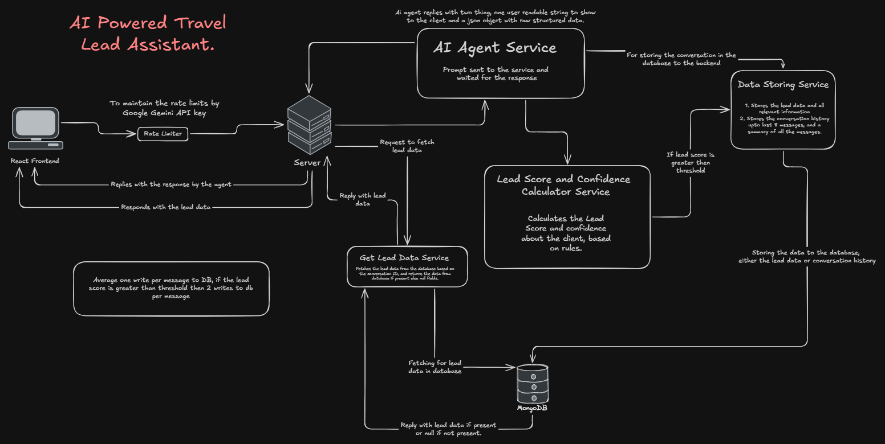

# AI Travel Assistant - Backend

This is the backend service for the AI Travel Assistant, designed to interface with the Google Gemini API.

## High Level Design (HLD)



## Getting Started

### Prerequisites

- [Node.js](https://nodejs.org/) (v18 or higher recommended)
- npm (comes with Node.js)

### Environment Setup

1. In the `backend` directory, ensure you have a `.env` file created.
2. Add your Google Gemini API key to the `.env` file:

```env
GEMINI_API_KEY=your_gemini_api_key_here
```

### Installation

Install the required dependencies:

```bash
npm install
```

### Starting the Server

To run the backend server, simply execute:

```bash
node server.js
```
